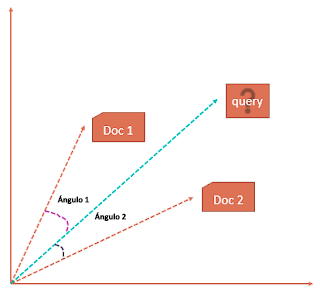

# Moogle!

> Proyecto de Programación I. Facultad de Matemática y Computación. Universidad de La Habana. Curso 2021.

`Est. David Sardiñas Lima C111`

Moogle! es una aplicación *totalmente original* cuyo propósito es buscar inteligentemente un texto en un conjunto de documentos.

Es una aplicación web, desarrollada con tecnología .NET Core 6.0, específicamente usando Blazor como *framework* web para la interfaz gráfica, y en el lenguaje C#.
La aplicación está dividida en dos componentes fundamentales:

- `MoogleServer` es un servidor web que renderiza la interfaz gráfica y sirve los resultados.
- `MoogleEngine` es una biblioteca de clases donde está implementada la lógica del algoritmo de búsqueda.

## Ejecutando el proyecto

Esta aplicación en cuanto es inicia, ejecuta el método `Start()` que este a su vez ejecuta una serie de métodos: 

- `ReadFolder()`: Este método devuleve el path de todos los documentos(*.txt) encontrados en la carpeta "Content" y sus subcarpetas.
- `ReadFiles()`: Como el mismo nombre lo indica, lee cada uno de documentos encontrados y guarda su Path y Contenido en la clase "Document".
- `WordsCollection()` : Recorre todos los documentos(contenido) y va agregando cada palabra a un List<string>, que será nuestro conjunto de palabras. No existe una palabra dos veces, pues en los conjuntos no hay elementos repetidas.
- `Create_TermDocumentMatrix()`: Este método crea un Array de Vectores, también visible como matriz. Una Matriz que tendrá `m+1` filas y `n` columnas, donde `m` es la cantidad de documentos y `n` la cardinalidad del conjunto de palabras del corpus. Estos Vectores son creados con el método `Vectorize()` que será explicado más adelante.

❓ Te preguntarás:  ¿Por qué la cantidad de filas de la matriz es `m+1`?  
Esto se debe a que el *(m+1)-ésimo* elemento será el valor del campo de busqueda `query`.

### Otros Métodos implicados en la inicialización

- `Vectorize()`: Crea un vector n-dimensional, donde `n` es la cardinalidad del conjunto de todas las palabras del corpus. Cada dimensión puede verse como una celda de la Matriz(intersección de una fila y una columna). Entonces en estas 'celdas' se va colocar el valor numérico que corresponde a la relevancia de palabra que corresponde a la n-ésima dimensión del vector.

#### ¿Cómo se calcula este valor numérico de relevancia? 

> TF*IDF o tf-idf es el acrónimo de “Term Frequency times Inverse Document Frequency”, que podemos traducir como “frecuencia del término por frecuencia inversa de documento”. Es una métrica desarrollada para encontrar el documento más relevante para cierto término dentro de una colección de documentos.
>
> ¿Cómo funciona? Mide con qué frecuencia aparece un término o frase dentro de un documento determinado, y lo compara con el número de documentos que mencionan ese  término dentro de una colección entera de documentos.

`TF-IDF()`: Este método simplemente devulve el resultado de multiplicar los valores devueltos por los métodos `TF()` e `IDF()`.

`TF()`: Devuelve la frecuencia del termino que se le pasa como parámetro: la cantidad de apariciones de una palabra en un documento dividido entre la cantidad total de palabras de ese documento.

`IDF()`: Devuelve la Frecuencia Inversa de Documento que no es más que: **IDF = log(D/deD)** donde D = cantidad de documentos y deD = cantidad de veces que se repite el termino en el corpus

Ya realizados estos procesos, la aplicación da el estado de listo ✔ y se puede comenzar a BUSCAR 🔎.

## Aplicación Lista para Buscar

Cuando se realiza una petición de búsqueda(*query*), esta es procesada por el método `Suggest()` a través del cuál se genera una *sugerencia* y son corregidos los errores de escritura del usuario, o si bien el usuario escribe una palabra correcta pero esta no genera resultados, el algoritmo sugiere una palabra similar que sí genera resultados.

`Suggest()`: este método manda a calcular la distancia de Levenshtein (LevenshteinDistance) de la palabra introducida por el usuario y cada una de las existentes en el Conjunto de Palabras del Corpus mediante el método `Calc_LevenshteinDistance` basado en el algoritmo `LevenshteinDistance`. Finalmente devuelve la palabra que con la que menor distancia tenga.

Acerca del algoritmo `LevenshteinDistance`: Este algortimo también es conocido como distancia de edición. La similaridad entre dos cadenas de texto A y B se basa en el conjunto mínimo de operaciones de edición necesarias para transformar A en B, o viceversa. Hay tres operaciones de edición, las cuales son destrucción, inserción y substitución. Entre más cerca de cero es la distancia de Levenshtein más parecidas son las cadenas.

**El algoritmo es el siguiente:**

- El tamaño de la cadena A es x, y el tamaño de la cadena B es y. Si x = 0, retornar y; si y = 0 retornar x.
- Construir una matriz con y + 1 filas y x + 1 columnas. Inicializar la primer fila de la matriz con la secuencia 0, 1, 2, ..., x; y la primer columna de la matriz con la secuencia 0, 1, 2, ..., y.
- Colocar cada carácter de la cadena A en su correspondiente celda i (i va de 1 a x).
- Colocar cada carácter de la cadena B en su correspondiente celda j (j va de 1 a y).
- Si A(i) es igual a B(j) el costo de la celda es 0.
- Si A(i) es diferente de B(j) el costo de la celda es 1.
- El valor de la celda d(i,j) es el mínimo de:
- Valor de la celda (i-1,j) + 1 (ELIMINACIÓN)
- Valor de la celda (i,j-1) + 1 (INSERCIÓN)
- Valor de la celda (i-1,j-1) + costo de celda (SUBSTITUCIÓN)
- La distancia es la celda d(x,y)

### Operadores

El usuario si desea puede hacer uso de ciertos operadores para una búsqueda más precisa y acorde a sus necesidades.

**Operadores:** 
- Ignorar(`!`): Siempre que aparezca ese símbolo delante de una palabra, se eliminará de los resultados todo documento que contenga dicha palabra.
- Necesario(`^`): Siempre que aparezca ese símbolo delante de una palabra, se comprobará que dicha palabra aparezca en el documento, de lo contratio no será agregado a los resultados.
- Prioridad(`*`): Cualquier cantidad de "asterisco" delante de una palabra le otorga a esta una mayor importancia, por lo que los documentos que la contengan tendrán mayor *Score*.
- Cercanía(`~`) : Cuando aparece este símbolo entre dos palabras, se requiere que estas palabras estén cerca en el documento, por lo que los documentos que más cerca tengan estas palabras tendrán un mayor *Score*.

### Evaluación del `score`

De manera general el valor de `score` debe corresponder a cuán relevante es el documento devuelto para la búsqueda realizada. Esto se calcula mediante un *Modelo de Espacio Vectorial*, que se basa en dos pasos fundamentales:
- Primero se representan el contenido de los documentos como vectores de palabras.(Realizado al inicio de la ejecución del programa)
- Segundo se transforman a un formato numérico para poder realizar actividades de Técnicas Recuperación de Información como extración y filtrado de información. 

Medidas de similitud: *similitud del coseno*
Matemáticamente, la cercanía entre dos vectores se obtiene calculando el coseno del ángulo entre ellos. De manera similar, podemos calcular el  coseno del ángulo entre cada vector de documento y el vector de consulta para encontrar su cercanía. Para encontrar un documento relevante para el término de la consulta, podemos calcular la puntuación de similitud entre cada vector del documento y el vector del término de la consulta aplicando la *similitud del coseno*. Finalmente, aquellos documentos que tengan puntajes de similitud altos se considerarán documentos relevantes para el término de consulta.

> Cuando graficamos el término matriz de documento, cada vector de documento representa un punto en el espacio vectorial. En la siguiente consulta de ejemplo, el Documento 1 y el Documento 2 representan 3 puntos en el espacio vectorial. Ahora podemos comparar la consulta con cada uno de los documentos calculando el coseno del ángulo entre ellos.
>
> 

### Mostrando los resultados

El programa finalmente devuelve el título de los documentos y una porción de este, donde se encuentra al menos una de las palabras buscadas(Métodod `Create_Snippet()`). Estos documentos son ordenados de mayor a menor de acuerdo a su valor de *Score*.

`Create_Snippet()`: Se obtiene la posición donde se encuentra la palabra buscada y se devuelve una subcadena donde se encuentra esta.

##### Enlaces de Interés:

- TF-IDF: https://es.wikipedia.org/wiki/Tf-idf
- Modelo de Espacio Vecotrial: https://www.datasciencecentral.com information-retrieval-document-search-using-vector-space-model-in/
- Distancia de Levenshtein: https://es.wikipedia.org/wiki/Distancia_de_Levenshtein

